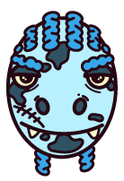
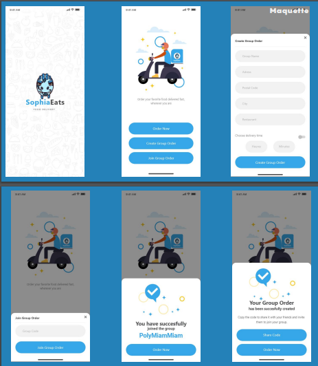

<h1 align="center">
  <br>
  
  <br>
  Sophia Eats
  <br>
</h1>

<h5 align="center">Sophia Eats est un système en ligne de commande de repas pour le campus, 
permettant aux étudiants et au personnel de commander facilement auprès de différents restaurants 
et de se faire livrer à des points spécifiques en un temps précis.</h5>

<p align="center">
  <a href="#team">Team</a> •
  <a href="#user-story">User Story</a> •
  <a href="#installation">Installation</a> •
  <a href="#structure-du-projet">Structure du projet</a> •
  <a href="#maquette">Maquette</a> •
  <a href="#doc">Doc</a>
</p>

---
## TEAM

<div align="center">
    <table style="border: none;">
        <tr>
            <td align="center" style="border: none;">
                
                <p>Nora KAYMA-KCILAR</p>
                <span style="font-weight: bold;">PO</span>
            </td>
            <td align="center" style="border: none;">
                
                <p>Romain ABBONATO</p>
                <span style="font-weight: bold;">OPS</span>
            </td>
            <td align="center" style="border: none;">
                
                <p>Matice MARILL</p>
                <span style="font-weight: bold;">QA</span>
            </td>
            <td align="center" style="border: none;">
                
                <p>Yohan MAZZI</p>
                <span style="font-weight: bold;">SA</span>
            </td>
            <td align="center" style="border: none;">
                
                <p>Mathias SANTOS REIS</p>
                <span style="font-weight: bold;">OPS</span>
            </td>
        </tr>
    </table>
</div>


## User Story

- **Référence** : [**[US] - Rejoindre un groupe de commande #37**](https://github.com/PNS-Conception/STE-24-25--teama/issues/37) 
- **Description** : **En tant qu'** [utilisateur enregistré], **je veux** [rejoindre un groupe de commande] **afin d'** être livré avec mon équipe et de profiter de **réductions**.   
- **Fichier Cucumber** : [`GroupOrderJoin.feature`](src/test/resources/features.steats/GroupOrderJoin.feature)
  - **Scénario de test** : 
    - **Scenario 1** : `Rejoindre une commande groupée`
      - Lorsqu’un utilisateur entre l’ID du groupe 456, il crée sa commande personnelle pour ce groupe. Le restaurant, la localisation et l'heure de livraison sont prédéfinis par la commande groupée, qui compte alors 2 membres.
    - **Scenario 2** : `Rejoindre une commande groupée validée`
      - Lorsqu’un utilisateur entre l'ID du groupe 789, déjà validé, il reçoit un message d'erreur indiquant que la commande est déjà validée et ne peut donc pas la rejoindre.
    - **Scenario 3** : `Rejoindre un groupe inexistant`
      - Lorsqu’un utilisateur entre l'ID d'un groupe inexistant (par exemple, 12345), il reçoit un message d'erreur précisant que le groupe n'existe pas et ne rejoint aucun groupe.


## Installation

Pour installer et lancer le projet en local :

1. **Cloner** le dépôt :
   ```bash
   git clone https://github.com/PNS-Conception/STE-24-25--teama
   cd STE-24-25--teama
   ```

2. Installer les **dépendances** Maven :
   ```bash
   mvn clean install
   ```

## Structure du projet

- **`doc/`** : Ce dossier regroupe les documents de référence et les rapports liés au projet.
  - 📄 **Exemple** : [`Rendu A2`](./doc/RenduA2.pdf)

- **`.github/`** : Configuration pour l'intégration continue et modèles d’issues.
  - **Workflows** : Le fichier **`workflows/maven.yml`** configure un test JUnit5 déclenché automatiquement à chaque push, pour garantir l’intégrité du code.
  - **Issue Templates** : Modèles prédéfinis pour la création des issues **`user_story`** et **`bug`**.

- **`src/`** : Contient l’intégralité du code source du projet ainsi que les tests.
  
  - **`src/main/`** : Ce dossier principal contient l'implémentation du projet, organisée en plusieurs packages pour une meilleure lisibilité et maintenabilité :
    - 📂 **`discount/`** : Gère la logique des **réductions** appliquées aux commandes.
    - 📂 **`order/`** : Regroupe les classes et méthodes pour la **gestion des commandes**.
    - 📂 **`restaurant/`** : Regroupe les classes et méthodes concernant les **restaurants**.
    - 📂 **`system/`** : Contient les **services centraux** de l'application.
    - 📂 **`user/`** : Module dédié à la **gestion des utilisateurs**.

  - **`src/test/`** : Dossier dédié aux tests.
    - **`src/test/java/`** : Inclut les **tests unitaires** de chaque package, organisés de manière cohérente avec `src/main`.
    - **`src/test/resources/`** : Regroupe toutes les **features de tests** écrites en Cucumber, permettant de valider les **user stories et scénarios utilisateur**.

  - **`pom.xml`** : Fichier de configuration **Maven** centralisant les dépendances du projet.

  
## Maquette

Voici la maquette de l'interface utilisateur de **Sophia Eats** :

<h1 align="center">
  <br>
  Maquette Sophia Eats
  <br>
  
</h1>

Pour voir le prototype interactif, cliquez sur le lien ci-dessous :
[Prototype Adobe XD](https://xd.adobe.com/view/40ccc17d-b58b-42cf-a602-96d7f7f0dd70-159f/)


## doc
La section `doc/` regroupe tous les rapports et documents détaillant les fonctionnalités et l’avancement du projet, pour fournir une vue d’ensemble exhaustive.

-📄[Rendu A2](./doc/RenduA2.pdf)
