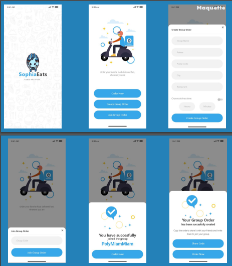

# Présentation des Images de Conception

## Group Members
- **KAYMA-KCILAR** Nora - PO
- **ABBONATO** Romain - OPS
- **MARILL** Matice - QA
- **MAZZI** Yohan - SA
- **SANTOS REIS** Mathias - OPS

---

## Glossary
- **Acteurs** :
    - Registered campus users
    - Restaurant owners
    - Campus administrators
    - Internet users
    - Delivery person
    - Payment system
- **Actions** :
    - N1 : browse menus ``(browseMenus)``
    - N2 : search restaurant ``(searchRestaurant)``
    - → N1 + N2 : consult restaurants
    - O1 : place order ``(placeOrder)``
    - R2 : update service ``(updateService)``
    - O2 : create group order ``(createGroupOrder)``
    - O3 : create order ``(createOrder)``
    - O4 : update delivery date ``(updateDeliveryDate)``
    - P1 : pay order ``(payOrder)``
    - P2 : register order ``(registerOrder)``
    - P3 : skip payment for group order ``(skipPaymentForGroupOrder)``
    - O5 : update restaurant capacity ``(updateRestaurantCapacity)``
    - E1 : apply discount ``(applyDiscount)``
    - O6 : validate group order ``(validateGroupOrder)``
    - O7 : allow group order validation ``(allowGroupOrderValidation)``

---

## Use Case Diagram

*Description : Ce diagramme illustre les cas d'utilisation principaux du système, montrant les interactions entre les utilisateurs et le système.*
---

## Class Diagram

*Description : Ce diagramme de classes montre la structure statique du système, avec les classes, leurs attributs, méthodes et les relations entre elles.*

---

## Sequence Diagram

*Description : Ce diagramme de séquence représente l'interaction entre les objets dans le temps pour un scénario spécifique.*

---

## Maquette

---
