<h1 align="center">
  
   
  Rapport Backend -Sophia Eats
   
</h1>

## Table des matières

- [Rapport Backend](#rapport-backend)
  - [Table des matières](#table-des-matières)
  - [I) Contexte](#i-contexte)
    - [1.1 Équipe](#11-équipe)
    - [1.2 Périmètre fonctionnel](#12-périmètre-fonctionnel)
      - [a) Hypothèses de travail](#a-hypothèses-de-travail)
      - [b) Limites identifiées](#b-limites-identifiées)
      - [c) Stratégies choisies et éléments spécifiques](#c-stratégies-choisies-et-éléments-spécifiques)
  - [II) Conception UML](#ii-conception-uml)
    - [2.1 Glossaire](#21-glossaire)
    - [2.2 Diagramme de cas d’utilisation](#22-diagramme-de-cas-dutilisation)
    - [2.3 Diagrammes de classes](#23-diagrammes-de-classes)
    - [2.4 Design patterns](#24-design-patterns)
    - [2.5 Diagramme de séquence](#25-diagramme-de-séquence)
  - [III) Maquette](#iii-maquette)
  - [IV) Qualités du code et gestion de projet](#iv-qualités-du-code-et-gestion-de-projet)
  - [V) Rétrospective et auto-évaluation](#v-rétrospective-et-auto-évaluation)
    - [Retours sur notre projet :](#retours-sur-notre-projet-)
    - [Leçons apprises :](#leçons-apprises-)
    - [Les erreurs :](#les-erreurs-)
    - [Missions remplies par les membres du groupe :](#missions-remplies-par-les-membres-du-groupe-)
    - [Auto-évaluation : 500 points à répartir](#auto-évaluation--500-points-à-répartir)

---

## I) Contexte

### 1.1 Équipe

    <table style="border: none;">
        <tr>
            <td align="center" style="border: none;">
                
                
Nora KAYMA-KCILAR

                PO
            </td>
            <td align="center" style="border: none;">
                
                
Romain ABBONATO

                OPS
            </td>
            <td align="center" style="border: none;">
                
                
Matice MARILL

                QA
            </td>
            <td align="center" style="border: none;">
                
                
Yohan MAZZI

                SA
            </td>
            <td align="center" style="border: none;">
                
                
Mathias SANTOS REIS

                OPS
            </td>
        </tr>
    </table>

### 1.2 Périmètre fonctionnel

#### a) Hypothèses de travail
- **Commande** : Une commande, qu’elle soit individuelle ou dans un groupe, est effectuée dans **un seul restaurant**.
- **Rejoindre une commande groupée** : Pour rejoindre un groupe, il est nécessaire de créer et de payer sa commande. Il est ensuite possible de passer une nouvelle commande qui remplacera la précédente. Tout utilisateur ayant passé commande peut valider le groupe et envoyer les commandes du groupe en préparation.
- **Restaurant** : Un restaurant dispose d’articles et de menus, qui sont des ensembles d’articles, définis par les restaurateurs, qui peuvent également mettre à jour leurs cartes.
- **Livraison** : Les livraisons sont considérées comme réalisables dans les délais impartis ; la gestion des livreurs et de leurs disponibilités n’est pas prise en charge par l’application.

#### b) Limites identifiées
- **Système de paiement** : Le système de paiement utilisé est un service externe à l’application ; les potentielles erreurs de paiement, les remboursements ou autres ne sont pas directement gérés par notre système.
- **Livraisons** : Le nombre de livreurs nécessaires et la répartition des commandes à livrer entre eux ne sont pas gérés au moment de la validation d’une commande.
- **Restaurants** : La gestion des commandes par les restaurants, comme l’utilisation de bons, n’est pas intégrée à l’application.

#### c) Stratégies choisies et éléments spécifiques
- **EX1** : Trois **stratégies** ont été mises en place pour inciter les utilisateurs à profiter des commandes groupées, facilitant ainsi la préparation et la livraison :
    - **Stratégies de récompense pour les commandes de groupe** :
        - **Nombre de personnes dans le groupe** : Réduction sur toutes les commandes.
        - **Nombre d’articles commandés** : Réduction sur les commandes concernées.
    - **Stratégie de récompense pour les commandes individuelles** :
        - **Nombre de commandes individuelles** : Réduction sur les commandes des utilisateurs concernés.
- **Avantages** : Ajout facile de nouvelles stratégies.
- **Limites** : Un restaurant ne peut appliquer qu’une seule stratégie à la fois.

- **EX2** : Concernant l'extension E2, nous avons pris en compte la capacité d’un restaurant en fonction du nombre de commandes dans le groupe. Cette gestion n’a cependant pas encore été étendue aux commandes individuelles ou globales du restaurant. Cela constitue une amélioration future à implémenter pour garantir que le restaurant ne prenne pas plus de commandes que sa capacité ne le permet sur une période donnée.

---

## II) Conception UML

### 2.1 Glossaire
**Acteurs** :
- Utilisateurs Internet
- Utilisateurs enregistrés du campus
- Propriétaires de restaurant
- Administrateurs du campus
- Livreurs
- Système de paiement

**Actions** :
- **N1** : Parcourir les menus (`browseMenus`) 
- **N2** : Rechercher un restaurant (`searchRestaurant`) 
    - → **N1 + N2** : Consulter les restaurants
- **O1** : Passer une commande (`placeOrder`) 
- **R2** : Mettre à jour le service (`updateService`) 
- **O2** : Créer une commande groupée (`createGroupOrder`) 
- **O3** : Créer une commande (`createOrder`) 
- **O4** : Mettre à jour la date de livraison (`updateDeliveryDate`) 
- **P1** : Payer une commande (`payOrder`) 
- **P2** : Enregistrer une commande (`registerOrder`) 
- **P3** : Ignorer le paiement pour une commande groupée (`skipPaymentForGroupOrder`) 
- **O5** : Mettre à jour la capacité du restaurant (`updateRestaurantCapacity`) 
- **E1** : Appliquer une réduction (`applyDiscount`) 
- **O6** : Valider une commande groupée (`validateGroupOrder`) 
- **O7** : Autoriser la validation d'une commande groupée (`allowGroupOrderValidation`) 

### 2.2 Diagramme de cas d’utilisation

  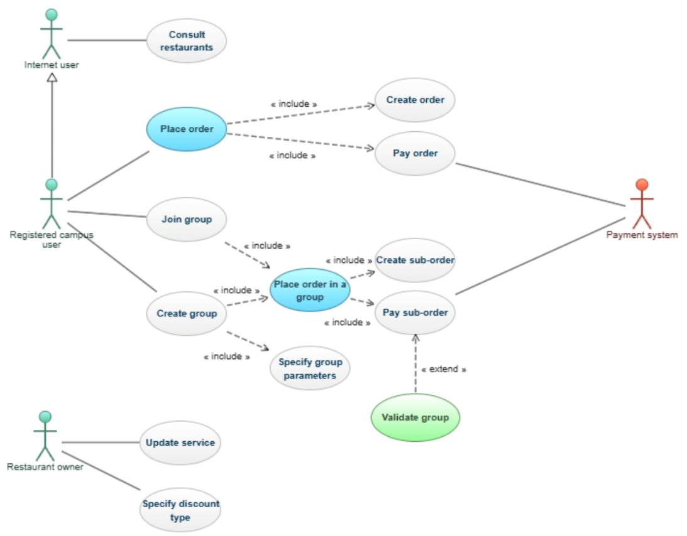

### 2.3 Diagrammes de classes
- **Order** :

  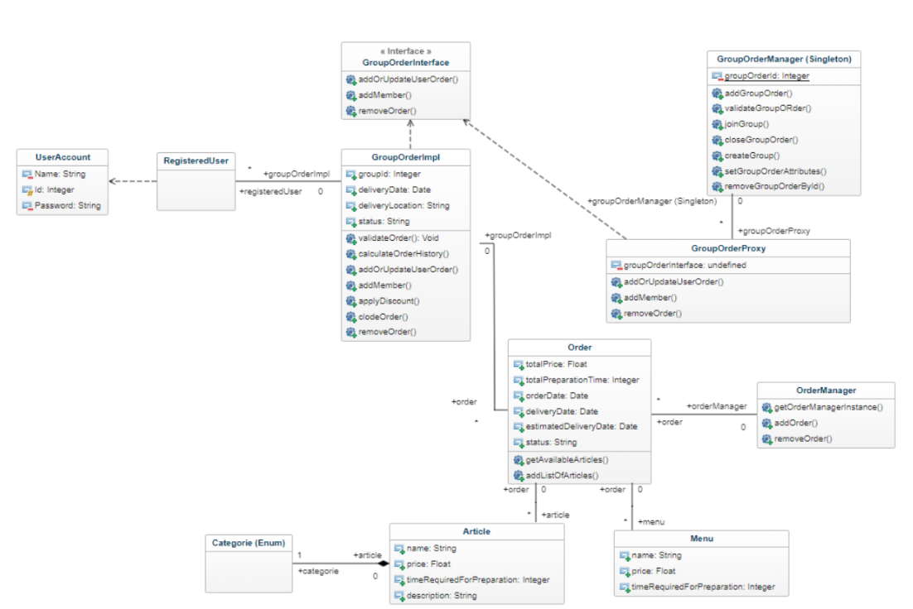

- **Restaurant** :

  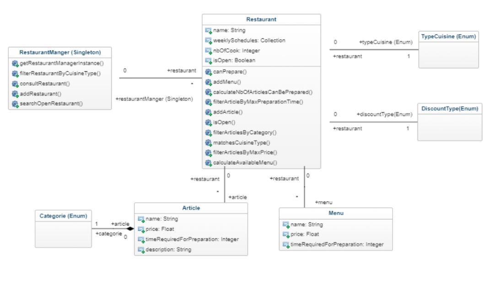

- **Discount** :

  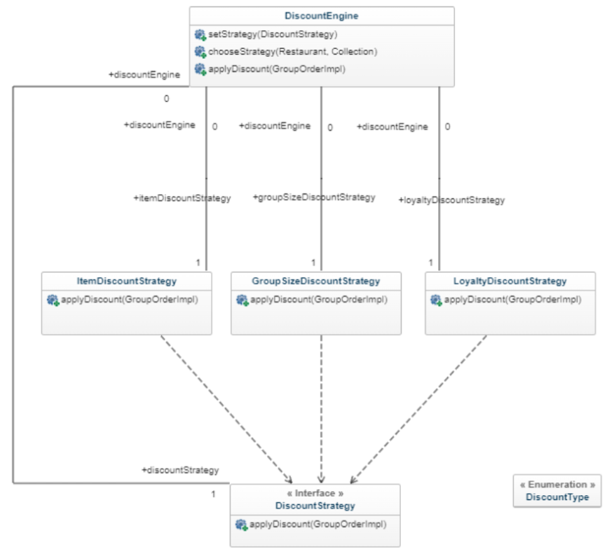

- **System** :

  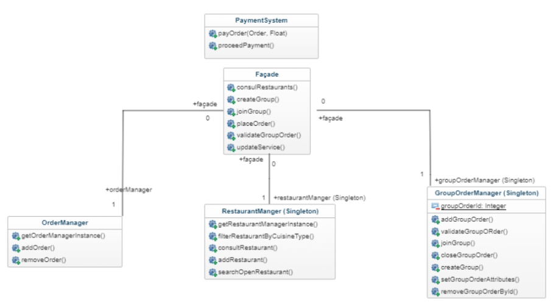

### 2.4 Design patterns
- **Singleton** : 

  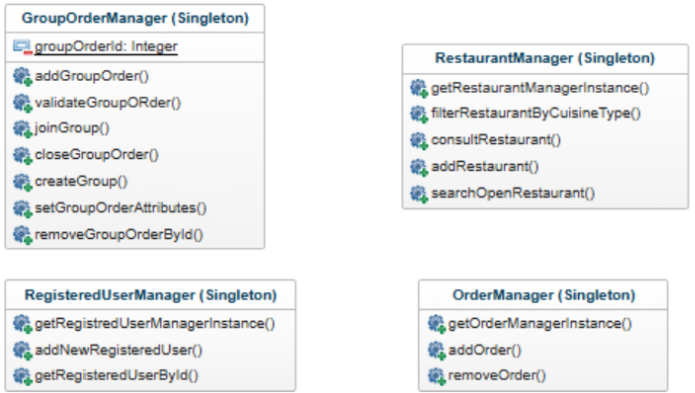

  Les singletons permettent de centraliser la gestion des instances sauvegardées (commandes, groupes, restaurants existants, utilisateurs) pour l'ensemble du système.

- **Proxy** : 

  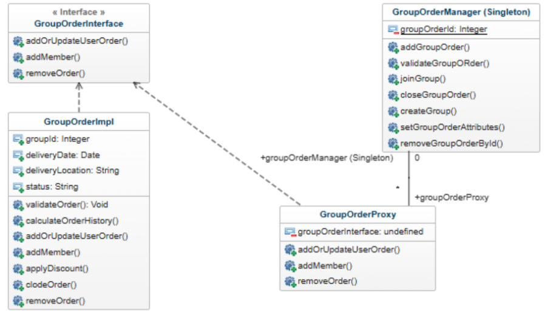

  L’utilisation du proxy pour les méthodes liées à la gestion des groupes permet de réaliser diverses vérifications (validité de la commande ajoutée dans le groupe, possibilité d’ajouter un utilisateur au groupe).

- **Façade** : 

  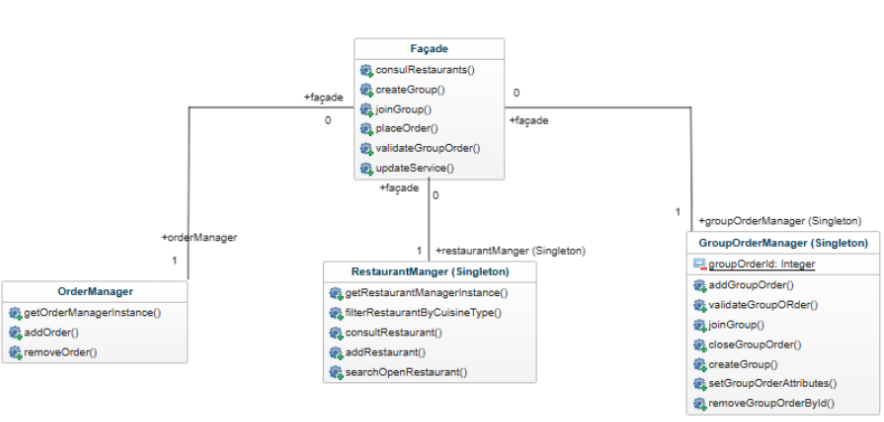

  La façade permet de séparer la logique métier (contenue dans les managers) de l’accès simplifié aux fonctionnalités (méthodes des façades) de l’application.

- **Stratégie** : 

  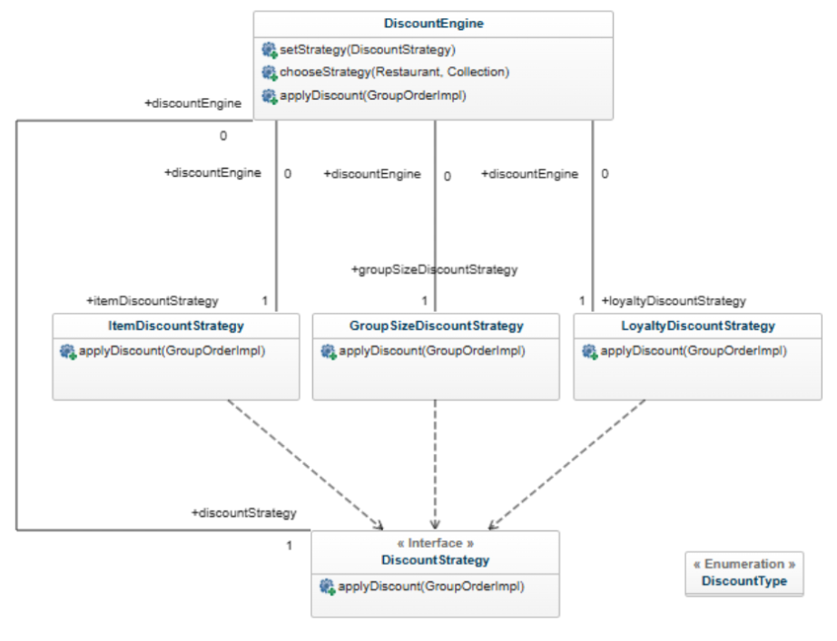

  Le pattern stratégie permet une flexibilité dans l’affectation des stratégies pour les restaurants et facilite l’ajout de nouvelles stratégies.

**Patterns manquants** :
Pour les managers, l’utilisation d’un pattern “repository” aurait permis de mieux séparer l’accès aux données de leur utilisation. Par manque de temps, nous avons combiné ces deux aspects.

Nous avions envisagé d'utiliser un “builder”, ce qui aurait facilité la construction d'une commande, car certaines commandes ne spécifient pas forcément de date de livraison (certaines commandes individuelles), d'autres n'ont pas besoin de spécifier le restaurant, la date et le lieu de livraison (sous-commandes dans les groupes de commandes) et d'autres doivent spécifier tous ces éléments (certaines commandes individuelles). Le rapport entre la valeur ajoutée à notre système et le temps que cela aurait pu prendre nous a finalement convaincus de ne pas utiliser ce pattern.

### 2.5 Diagramme de séquence
[Lien Lucidchart](https://lucid.app/lucidchart/36cb9c8f-1a42-4272-b629-6f848c2d5656/edit?invitationId=inv_1881387b-d263-49e4-b827-5c061b723c7c&page=0_0#)
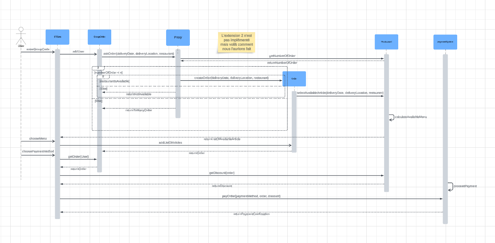

---

## III) Maquette
Maquette pour une prise de commande dans le contexte d’une commande groupée :

  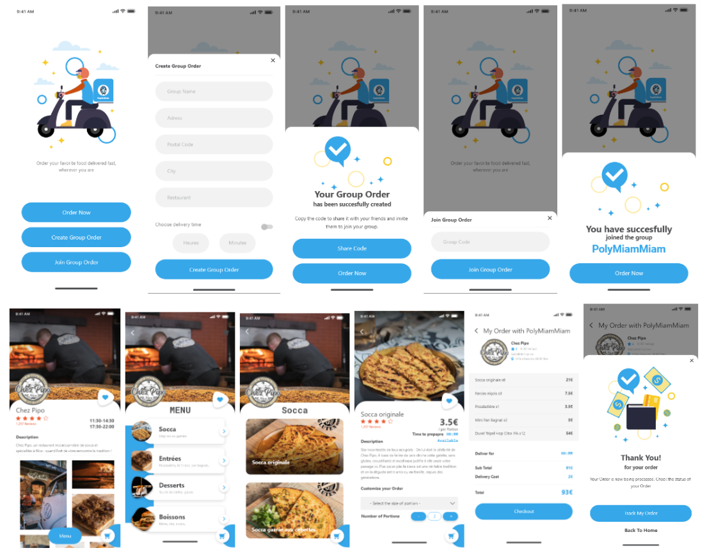

---

## IV) Qualités du code et gestion de projet
Dans notre projet, nous avons mis en œuvre divers types de tests pour assurer la qualité et la robustesse de notre code. Nous avons réalisé des tests unitaires à l'aide de JUnit, permettant de valider chaque composant individuellement et garantissant que chaque fonction et méthode se comporte comme prévu. De plus, nous avons utilisé des scénarios Gherkin pour définir des tests de comportement couvrant des cas d'usage et des cas d'erreurs. Grâce à cette approche, nous avons atteint une couverture de tests de 75 %, couvrant ainsi une part significative du code et garantissant que les fonctionnalités principales sont bien testées (les 25 % restants étant des méthodes des packages System et Users). L’analyse avec SonarQube a confirmé la bonne qualité du code, avec peu de "code smells" (la plupart étant des variables ou attributs non utilisés) et une base de code propre. 

Pour la gestion du projet, nous avons adopté le "GitHub Flow", avec une gestion stricte des branches. Cette méthodologie nous a permis de travailler sur des branches de fonctionnalités séparées et de réaliser des pull requests pour la revue de code.

---

## V) Rétrospective et auto-évaluation

### Retours sur notre projet :
**Ce qui a bien été mené** :  
L’architecture du code a bien été respectée et l’étude de cas (définitions, termes et points importants) a été discutée en détail au sein de l’équipe, ce qui a permis d’avancer dans la même direction.

### Leçons apprises :
Une compréhension précise du sujet est primordiale, définir un glossaire permet de définir les termes principaux et éviter des interprétations différentes au sein d’une équipe. De plus, lorsque l’on conçoit l’architecture, il est important de se baser sur les spécifications détaillées au préalable et de se demander si un design pattern déjà existant peut être utilisé et adapté à notre problème.

### Les erreurs : 
Nous n’avons pas suivi un plan bien établi et détaillé en ce qui concerne la livraison de valeur sur une période de temps définie (chaque semaine…).
En ce qui concerne notre premier rendu, il était incomplet et une grosse partie de l’architecture (diagramme de classe) a été à revoir, ce qui nous a coûté beaucoup de temps pour redéfinir les rendus à effectué et la répartition des tâches au sein de l’équipe.

### Missions remplies par les membres du groupe :

- **Yohan Mazzi (SA)** :  

En tant que **Software Architect**, ma mission a été de m’assurer de la cohérence entre notre développement et les diagrammes que nous avions initialement produits. 
J’ai donc en premier lieu conceptualisé une première version du diagramme de classe et du diagramme de cas d’utilisations. Dans un second temps, j’ai fait évoluer au fur et à mesure du développement ces deux diagrammes, afin qu’ils respectent nos changements de point de vue de conception et les nouvelles contraintes que le développement et le projet nous imposaient.

Au niveau du développement, j’ai pu mettre en place les squelettes des singletons pour les managers ainsi que celui de la façade. Je me suis par la suite concentré sur les fonctionnalités (méthodes, tests, scénarios…) permettant de créer et rejoindre un groupe de commande.

- **Nora Kayma-kcilar (PO)** :  

En tant que **Product Owner**, j’ai été responsable de m'assurer que les fonctionnalités développées répondent aux attentes des utilisateurs. Je me suis principalement chargée du développement de la logique de validation des commandes de groupe et à implémenter les différentes stratégies de réduction.

En travaillant sur ces deux axes, j’ai veillé à ce que la fonctionnalité de prise de commande groupée soit fluide : garantir que chaque commande individuelle au sein d’un groupe respecte les paramètres communs, tels que la date, le lieu de livraison et le restaurant sélectionné. J'ai également veillé à ce que les commandes ne puissent plus être modifiées une fois validées, ce qui inclut la mise à jour du statut de la commande pour pouvoir notifier le lancement de préparation des repas. 

Enfin, j'ai intégré la stratégie de réduction choisie par le restaurant : l’implémentation de ces stratégies repose sur trois critères que nous avons décidé de prendre en compte : la taille du groupe, le nombre d’articles commandés et la fidélité des clients (validées à travers de tests pour s’assurer le bon fonctionnement de chaque type de réduction).

Mais l'extension E2 n'a pas encore été implémentée. Nous avons choisi de prioriser les fonctionnalités liées à l’idée même du processus de commande de groupe avant de passer à la gestion côté restaurant. Cela reste donc une future amélioration pour rendre le système encore plus performant et conforme aux attentes des utilisateurs.

- **Mathias Santos Reis (OPS)** :  

En tant qu'Operations Manager **(OPS)** sur ce projet, mon rôle a été de garantir la stabilité en veillant à l'intégration en continu du code. La gestion de l’état du repository a été également l’une de mes missions.

- **Romain Abbonato (OPS)** :  

En tant qu'Operations Manager **(OPS)** sur ce projet, ma mission principale a été de garantir l'efficacité et la qualité des processus de développement, ainsi que la gestion des commandes. J'ai commencé par créer les premières classes du package order, notamment celles liées à [``GroupOrder``](../src/main/java/fr/unice/polytech/order/GroupOrder.java) et à [``Order``](../src/main/java/fr/unice/polytech/order/Order.java).

Par la suite, j'ai travaillé sur le [``GroupOrderProxy``](../src/main/java/fr/unice/polytech/order/GroupOrderProxy.java), une fonctionnalité essentielle pour gérer les commandes groupées. J'ai veillé à ce que ce proxy vérifie la disponibilité des restaurants avant de finaliser une commande, assurant ainsi une expérience utilisateur fluide. 
J'ai également élaboré des user stories concernant les filtres des 
restaurants et des menus. 

Dans le cadre de mes responsabilités en tant qu'**OPS**, je me suis assuré de la bonne organisation des différentes issues dans notre système de gestion de projet. J'ai joué un rôle actif dans la gestion de notre dépôt Git.

### Auto-évaluation : 500 points à répartir
- Nora Kayma-kcilar : 100
- Yohan Mazzi : 100
- Mathias Santos Reis : 100
- Romain Abbonato : 100
- Marill Matice : 100
